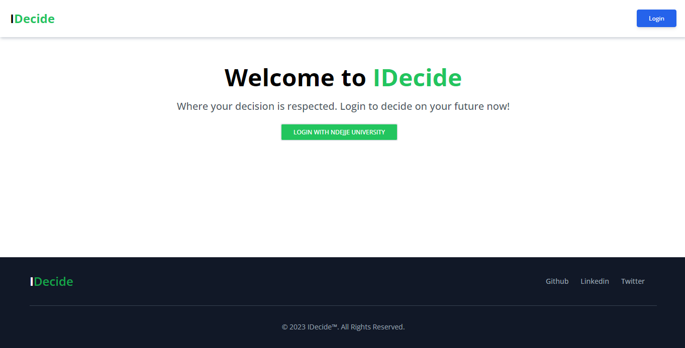

# IDecide Votiing App
Idecide voting is an idea where power entirely belongs to the people. Wit Idecide, we are seeking to make the process of voting/electoral process as decentralised as possible by leveraging the power of blockchain. 

I built this project as my University final year project. If you love it please give it a star 



## Tools used

- Vscode
- Metamask
- Wagmi
- Alchemy
- React
- Solidity

## Getting started

Clone this repository

Go to the root directory

Create an .env and include ;
```
REACT_APP_ENDPOINT_URL
REACT_APP_DEPLOYER_KEY
```

Run the following commands
```
npm install
npm start
```

**You also need to deploy your smart contract.**

Got to the scripts folder and run 
```
node deploy.js
```

**Authors:**
- Pascal Byabasaija


